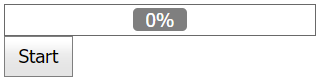

<!-- default badges list -->

<!-- default badges end -->
# How to use HTTP modules to display the progress of a server-side process on the client
<!-- run online -->
**[[Run Online]](https://codecentral.devexpress.com/e4656/)**
<!-- run online end -->

This example demonstrates how to implement a custom HTTP module to get information about the current progress from the server and display it on the client.

In the example, an instance of the `Test` static class stores a progress value. This class has a global scope and should be thread-safe.

## Files to Review

* [CustomModule.cs](./CS/App_Code/CustomModule.cs) (VB: [CustomModule.vb](./VB/App_Code/CustomModule.vb))
* [TaskManager.cs](./CS/App_Code/TaskManager.cs) (VB: [TaskManager.vb](./VB/App_Code/TaskManager.vb))
* [Test.cs](./CS/App_Code/Test.cs) (VB: [Test.vb](./VB/App_Code/Test.vb))
* [Default.aspx](./CS/Default.aspx) (VB: [Default.aspx](./VB/Default.aspx))
* [Default.aspx.cs](./CS/Default.aspx.cs) (VB: [Default.aspx.vb](./VB/Default.aspx.vb))

## Documentation

- [HTTP Handlers and HTTP Modules Overview](https://learn.microsoft.com/en-us/previous-versions/aspnet/bb398986(v=vs.100))
- [Walkthrough: Creating and Registering a Custom HTTP Module](https://learn.microsoft.com/en-us/previous-versions/aspnet/ms227673(v=vs.100))

## More Examples

- [ASP.NET Web Forms - How to use HTTP handlers to display the progress of a server-side process on the client](https://github.com/DevExpress-Examples/asp-net-web-forms-use-httphandler-to-display-server-side-process-progress)
- [ASP.NET Web Forms - How to display progress information about server-side callback processing](https://github.com/DevExpress-Examples/web-forms-display-progress-information-about-callback-process)
- [Progress Bar for ASP.NET Web Forms - How to use the WebMethod attribute to display the progress of a server-side process on the client](https://github.com/DevExpress-Examples/asp-net-web-forms-progress-bar-display-server-process-progress)
- [Grid View for ASP.NET Web Forms - How to show a lengthy operation's progress and allow canceling such operations](https://github.com/DevExpress-Examples/asp-net-web-forms-grid-show-operation-progress-and-cancel-operation)
